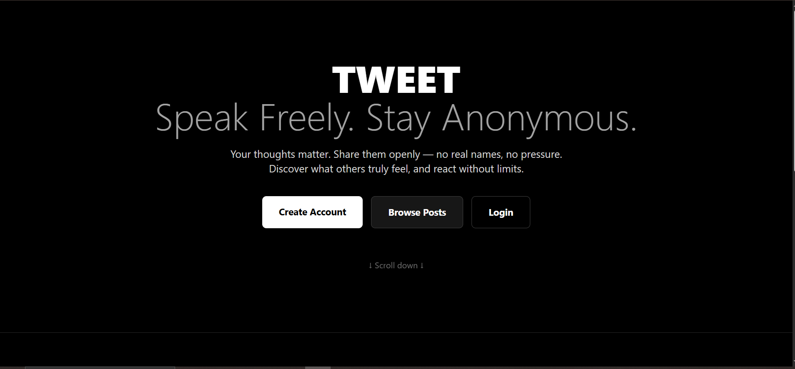
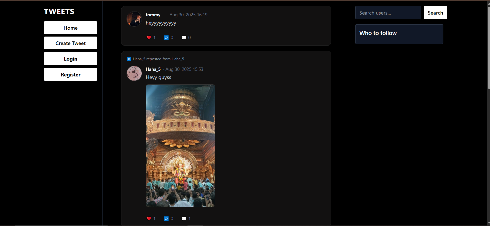

#  Tweet WebApp  

A simple **Twitter-like web application** where users can post and view tweets.  
Built with **Django (Python backend)**, **Tailwind CSS (frontend styling)**, and **PostgreSQL (database)**.  

🔗 **Live Demo**: [tweet-hveo.onrender.com](https://tweet-hveo.onrender.com)  

---

## 🚀 Features  
-  Create and post tweets  
-  View all tweets in a feed  
-  Responsive design with **Tailwind CSS**  
-  Data stored in **PostgreSQL**  
-  User authentication (login & signup)  
-  Simple and fast UI  

---
## 📸 Screenshots

  

  


---

## 🛠️ Tech Stack  
- **Backend:** Django (Python)  
- **Frontend:** Tailwind CSS  
- **Database:** PostgreSQL  
- **Deployment:** Render  

---

## 📂 Project Setup  

### 1️⃣ Clone Repository  
```bash
git clone https://github.com/your-username/tweet-app.git
cd tweet-app
```

### 2️⃣ Create Virtual Environment  
```bash
python -m venv venv
source venv/bin/activate   # On Linux/Mac
venv\Scripts\activate      # On Windows
```

### 3️⃣ Install Dependencies
```bash

pip install -r requirements.txt

```

### 4️⃣ Database Setup (PostgreSQL)
Make sure PostgreSQL is running. Update your settings.py with your DB credentials:

```bash

DATABASES = {
    'default': {
        'ENGINE': 'django.db.backends.postgresql',
        'NAME': 'tweetdb',
        'USER': 'postgres',
        'PASSWORD': 'yourpassword',
        'HOST': 'localhost',
        'PORT': '5432',
    }
}

```
 Run migrations:

```bash

python manage.py migrate

```

### 5️⃣ Run Server
```bash
python manage.py runserver
```


## 🤝 Contributing

Contributions are welcome!
Fork the repo
Create a new branch (feature/your-feature-name)
Commit changes and push
Open a Pull Request

## 📜 License

This project is licensed under the MIT License.